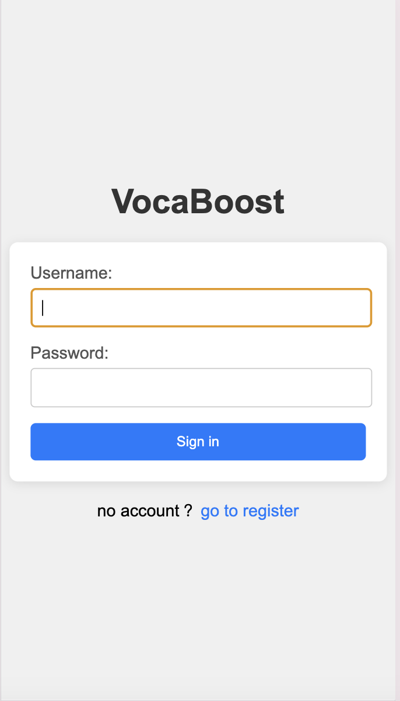
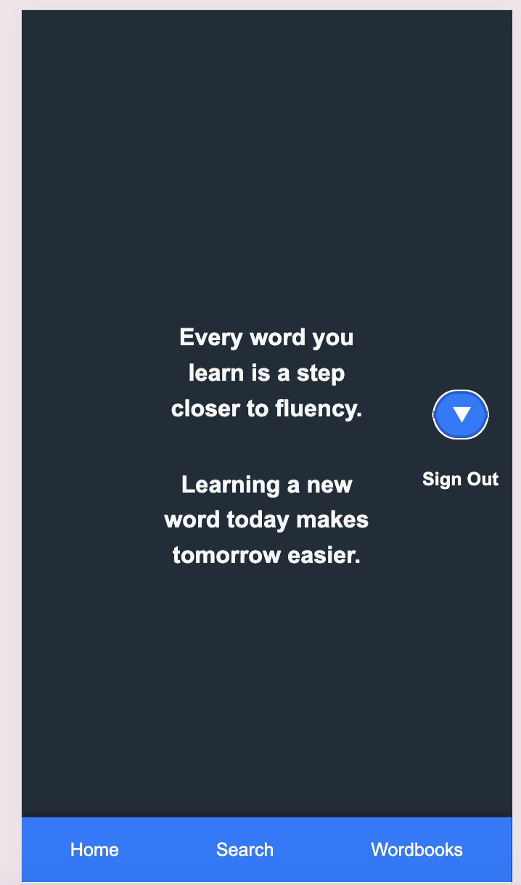
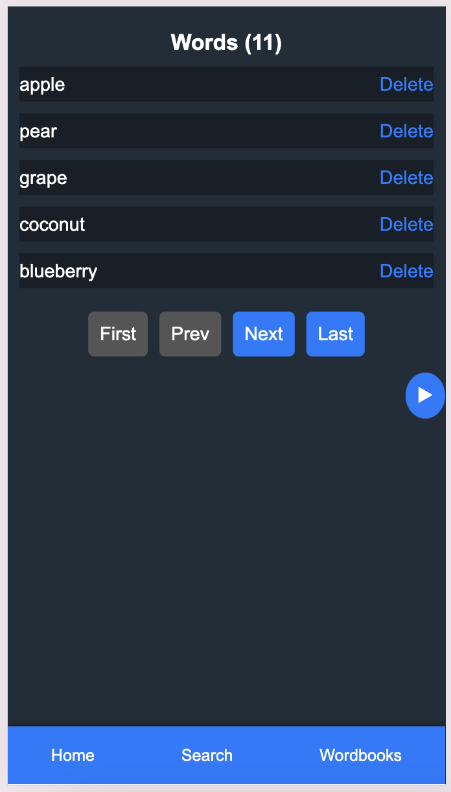
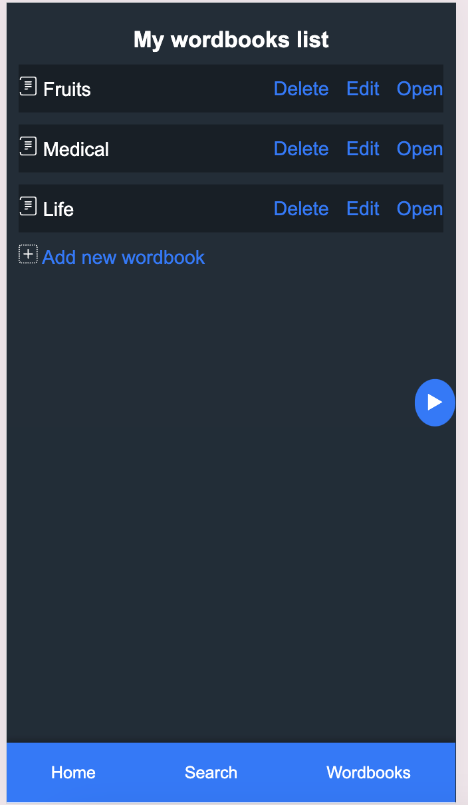
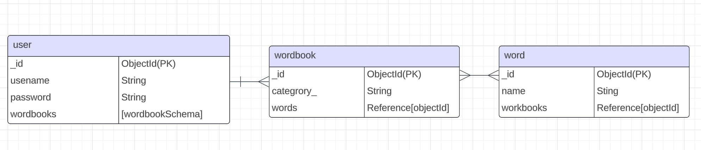

# Vocabulary Learning App

## Project Description

An English Vocabulary Learning App is designed to help users expand and improve their English vocabulary in an engaging and effective way

## Interact Here

[Deployed URL](https://vocabulary-learning-app-97239a073f2c.herokuapp.com/)
[GitHub URL](https://github.com/kevinsubmit/Vocabulary-Learning-App/)

**Initial Landing View**

**Home View**

**Results View**

## User Stories

#### MVP Goals

- As a user, you have the functions to login, log in, and log out.
- As a user, you can search for the meaning of unfamiliar words.
- As a user, you can add unfamiliar words to your personal wordbooks.
- As a user, you can remove words from your wordbooks.
- As a user, you can customize or delete the types of wordbooks, such as Medical, Architecture, Computing, Daily, or Unfamiliar, etc.

#### Stretch Goals

- As a user, you can have many background themes for choosing.
- As a user, you can translate different languages.

## ERD

## Restful Routes
### Sign-Up Sign-In Sign-Out Routes

|  Action    |             Route                                  | HTTP Verb  | 
|------------|----------------------------------------------------|------------|
|  login     |   ‘/login’                                         |    GET     |  
|  login     |   ‘/auth/login’                                    |    POST    |
|  Login     |   ‘/login’                                         |    GET     |  
|  Login     |   ‘/auth/login’                                    |    POST    |  
|  Logout    |   ‘/login’                                         |    GET     | 
|  Logout    |   ‘/auth/logout'                                   |    POST    | 
 

### Deal Wordbook Routes:
|  Action    |             Route              | HTTP Verb|
|------------|--------------------------------|----------|
|  Index     |   ‘/wordbooks’                 |  GET     |
|  New       |   ‘/wordbooks/new’             |  GET     |
|  Create    |   ‘/wordbooks’                 |  POST    |    
|  Show      |   ‘/wordbooks/:wordbookId'     |  GET     |            
|  Edit      |   ‘/wordbooks/:wordbookId/edit’|  GET     |  
|  Update    |   ‘/wordbooks/:wordbookId’     |  PUT     |                       
|  Delete    |   ‘/wordbooks/:wordbookId’     |  DELETE  |  

### Deal Words Routes:
|  Action    |             Route                    | HTTP Verb  |
|------------|---------------------------------------------------|
|  Search    |   ‘/words’                           |  POST(api) |  
|  Collect   |   ‘/words/:wordbookId'               |  POST      |
|  Collect   |   ‘/words/:wordId'                   |  GET       |
|  Remove    |   ‘/words/:wordId/wordbookId/remove’ |  DELETE    |

### Timeline

| Day        |   | Task                               | Blockers | Notes/ Thoughts |
|------------|---|------------------------------------|----------|-----------------|
| Thursday   |   | Think and Create proposal          |          |about application|
| Friday     |   | Finish proposal                    |          |create template  |
| Monday     |   | Implement the backend schema       |          |js variablles    |
| Tuesday    |   | Finish static webpages             |          |main  webpages   |
| Wesnesday  |   | Continue writing  static webpages  |          |                 |
| Thursday   |   | Finish defining cons vars funs     |          |                 |
| Friday     |   | Install the main framework         |          |                 |
| Monday     |   | Writing main logic                 |          |                 |
| Tuesday    |   | Testing the program myself         |          |cheak again      |

